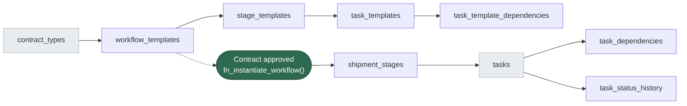
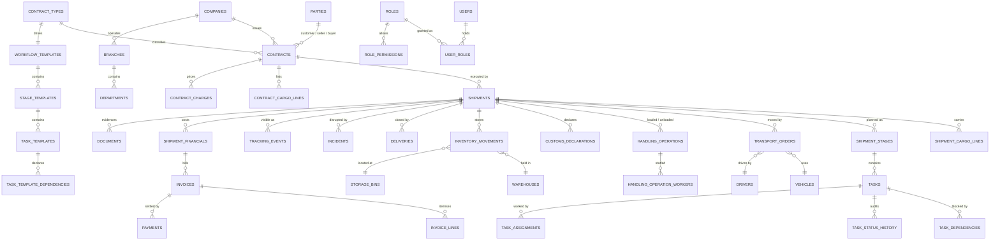
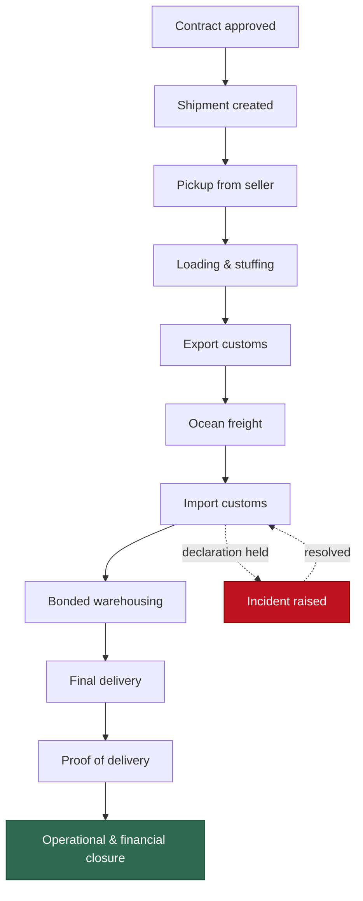

# Logistics Operations & Task Dispatch Platform

**A PostgreSQL database design for door-to-door freight execution.**


**Verified against PostgreSQL 16 (local) and PostgreSQL 17 (Supabase).** The full migration chain runs from empty with no environment-specific changes. RLS tenant isolation tested under non-superuser roles — 9/9 tests passing in both environments.

Most logistics databases store shipments. This one **dispatches** them.

Every approved contract generates a live operational plan — stages, tasks, owners, dependencies, deadlines. When customs holds a container, the blocked work, the delay hours and the eroded margin all fall out of the schema without a line of application code deciding it.

Built from a functional specification covering eighteen operational modules, from contract intake through to financial closure.

---

## Contents

- [The problem this solves](#the-problem-this-solves)
- [The workflow engine](#the-workflow-engine)
- [Entity relationship diagram](#entity-relationship-diagram)
- [Contract templates](#contract-templates)
- [Task dependencies](#task-dependencies)
- [The audit trail](#the-audit-trail)
- [Worked scenario: Sudan → Sharjah](#worked-scenario-sudan--sharjah)
- [Quick start](#quick-start)
- [Repository layout](#repository-layout)
- [Design decisions](#design-decisions)
- [Known limits](#known-limits)

---

## The problem this solves

A freight forwarder handling door-to-door movements faces the same operational question a hundred times a day: **what needs doing right now, by whom, and what is blocking it?**

Spreadsheets answer that badly. Generic project tools answer it without understanding cargo, customs or margin. Most bespoke logistics software answers it by hard-coding the workflow into application logic — which means every new service line becomes a development ticket.

This schema takes a different position: **the workflow is data, not code.**

---

## The workflow engine

This is the core of the design and the part worth understanding first.



**Left side is configuration. Right side is live operations.**

A template is defined once per contract type. Approving a contract calls one function:

```sql
SELECT fn_instantiate_workflow(shipment_id);
```

That single call reads the template, skips stages the contract doesn't need, creates the live stages and tasks, schedules them from offset hours, and replays the template's dependency edges onto the real tasks.

Three consequences that matter in practice:

| | |
|---|---|
| **Configuration, not deployment** | An operations manager adds a "Quality Inspection" task to the reefer workflow without involving a developer. |
| **Shipments in flight are immune** | Each holds its own instantiated copy. Editing a template on Monday cannot silently rewrite Friday's shipment. |
| **No hard-coded sequence** | `v_ready_tasks` returns whatever is genuinely unblocked, for any workflow shape, from one query. |

### Conditional stages

Stage templates carry skip conditions evaluated at instantiation:

```sql
skip_if_no_warehouse BOOLEAN   -- drop bonded storage on direct-delivery contracts
skip_if_domestic     BOOLEAN   -- drop customs stages on domestic moves
```

A company with no warehouse never sees a warehousing stage. Same schema, same template family, different instantiation.

---

## Entity relationship diagram



*Core relationships shown. Full detail in [`docs/SCHEMA_DESIGN.md`](docs/SCHEMA_DESIGN.md).*

### The shipment lifecycle



---

## Contract templates

Contract types are a **lookup table, not an enum** — because the specification requires the system to serve companies with different business models, and inventing a new service line must not require a database migration.

The seed data defines `DOOR_DOOR_SEA`, which declares its own operational shape:

| Attribute | Value | Effect at instantiation |
|---|---|---|
| `origin_is_door` | true | Pickup stage included |
| `destination_is_door` | true | Final delivery stage included |
| `is_international` | true | Export and import customs stages included |
| `involves_warehouse` | true | Bonded storage stage included |
| `default_mode` | sea | Ocean leg planned |

Its template produces **eight stages and seventeen tasks**:

```
10 PICKUP          → prepare vehicle, collect cargo
20 LOADING         → verify documents, stuff and seal container
30 EXPORT_CUSTOMS  → file declaration, obtain release
40 MAIN_LEG        → book vessel, issue B/L, monitor transit
50 IMPORT_CUSTOMS  → file declaration, settle duty and VAT
60 WAREHOUSE       → receive and inspect, put away
70 FINAL_DELIVERY  → final leg, unload, capture POD
80 CLOSURE         → reconcile costs, close file
```

Each task template carries its default department, priority, scheduling offset, duration, and the gates it must pass — required document type, signature, photograph, and whether failure blocks the whole shipment.

---

## Task dependencies

Dependencies are declared **once on the templates** and replayed onto live tasks at instantiation. They are finish-to-start, and they cross stage boundaries freely — the ocean leg cannot start until export release is granted, regardless of which stage each task sits in.

The dispatch board is one view with no procedural logic:

```sql
CREATE VIEW v_ready_tasks AS
SELECT ...
  FROM tasks t
 WHERE t.status IN ('created','assigned','scheduled')
   AND NOT EXISTS (
        SELECT 1 FROM task_dependencies td
          JOIN tasks p ON p.id = td.depends_on_task_id
         WHERE td.task_id = t.id
           AND p.status NOT IN ('completed','closed')
   );
```

When a task completes, whatever it was blocking appears on the board automatically. When a task goes to `waiting`, everything downstream disappears from it. Nobody writes code to decide this.

An index exists specifically for the reverse question — *what does finishing this task unblock?* — because that walks the graph the opposite way to the primary key:

```sql
CREATE INDEX idx_task_dependencies_reverse ON task_dependencies(depends_on_task_id);
```

---

## The audit trail

The specification requires every task status change to record date, time, user, action and reason. That is implemented as a database trigger, not application code:

```sql
CREATE TRIGGER trg_tasks_status_history AFTER UPDATE ON tasks
    FOR EACH ROW EXECUTE FUNCTION fn_log_task_status();
```

The trigger reads the acting user from a session variable:

```sql
SET app.current_user_id = '1';
```

**Why in the database:** application code can be bypassed — by a migration script, a background job, a bulk correction, or the next developer in a hurry. A trigger cannot. If the row changed, the history exists.

`task_status_history` is append-only and never updated. Neither the seed file nor the demo script inserts a single row into it, yet after running both it is fully populated. That is the demonstration.

A separate `audit_log` table captures cross-cutting forensic changes with JSONB before/after snapshots.

---

## Worked scenario: Sudan → Sharjah

The seed data is a real trade lane, not placeholder rows.

> **26 MT of white sesame seed, 99/1 purity**, 520 bags at 50 kg, moving door-to-door from Nile Valley Agro Export in Khartoum North to Emirates Food Industries in Sharjah. CIF terms, contract value **AED 68,500**, container MSCU7734190.

The route: Khartoum → Port Sudan (road, 830 km) → Jebel Ali (ocean) → SAIF Zone bonded warehouse → buyer's plant.

**The seed leaves the shipment in trouble.** The import declaration is `held` at Jebel Ali pending phytosanitary verification by MOCCAE, a critical incident is open, demurrage is accruing, and every downstream task is blocked by the dependency graph.

Run `03_demo_customs_hold.sql` to continue the story — a nine-act walkthrough that resolves the hold, completes delivery (with 4 damaged bags), invoices the customer, demonstrates the audit trail, and shows five constraint violations the database refuses.

Run `08_realistic_financials.sql` to see the hold's financial impact:

```sql
-- Three-way margin analysis shows the shipment going underwater
SELECT shipment_no, booked_margin_pct, projected_margin_pct, actual_margin_pct
FROM v_shipment_margin_analysis WHERE shipment_id = 1;

-- Original estimate vs reality
-- Booked margin:   ~25% (optimistic quote at contract)
-- Projected margin: -1.7% (LOSS after customs hold costs)
```

The customs hold adds: demurrage ($1,350 USD), extended storage (7 days vs 2), MOCCAE inspection fee, container unstuffing/restuffing, expedited clearance overtime, and a credit note to the customer for delay — turning a healthy margin into a loss.

---

## Quick start

```bash
git clone https://github.com/<your-username>/logistics-platform.git
cd logistics-platform

createdb logistics
psql -d logistics -f sql/01_schema.sql
psql -d logistics -f sql/02_seed.sql
psql -d logistics -f sql/03_demo_customs_hold.sql   # nine-act walkthrough
psql -d logistics -f sql/04_countries_customs.sql
psql -d logistics -f sql/06_rls_policies.sql
psql -d logistics -f sql/07_margin_analysis.sql
psql -d logistics -f sql/08_realistic_financials.sql
```

Then explore:

```sql
-- what can be dispatched right now
SELECT task_no, task_name, stage_name, priority, is_overdue FROM v_ready_tasks;

-- did this shipment make money after the customs hold?
SELECT tracking_no, total_revenue, total_cost, gross_profit, margin_percent
  FROM v_shipment_profitability;

-- customer-facing status
SELECT * FROM v_shipment_tracking;

-- warehouse balances, derived from the movement ledger
SELECT * FROM v_stock_on_hand;

-- the audit trail nothing inserted into
SELECT t.code, h.from_status, h.to_status, h.changed_at
  FROM task_status_history h JOIN tasks t ON t.id = h.task_id
 ORDER BY h.changed_at;
```

---

## Repository layout

```
logistics-platform/
├── README.md
├── LICENSE
├── docs/
│   └── SCHEMA_DESIGN.md              design rationale, decisions and trade-offs
└── sql/
    ├── 01_schema.sql                 53 tables, 19 enums, 31 indexes, 5 views,
    │                                 4 functions, 7 triggers, 44 named constraints
    ├── 02_seed.sql                   company, workflow template, contract,
    │                                 shipment held at customs (BIGINT IDs)
    ├── 03_demo_customs_hold.sql      nine-act walkthrough: customs hold, resolution,
    │                                 delivery, invoicing, audit trail, constraint demos
    ├── 04_countries_customs.sql      ISO 3166/4217 reference data, customs unions,
    │                                 temporal membership, Brexit-aware
    ├── 05_rls_tests.sql              RLS test suite (run before and after policies)
    ├── 06_rls_policies.sql           multi-tenant Row-Level Security for 50 tables
    ├── 07_margin_analysis.sql        three-way margin view (booked, projected, actual)
    │                                 with superseded_by estimate→actual linking
    └── 08_realistic_financials.sql   seed data demonstrating a shipment going
                                      underwater due to customs hold costs
```

---

## Design decisions

Explained in full in [`docs/SCHEMA_DESIGN.md`](docs/SCHEMA_DESIGN.md). In brief:

**One `parties` table, not three.** The same legal entity is a buyer on one contract and a seller on the next. The role belongs on the contract, because a role is a fact about a transaction, not about a company.

**Enums for lifecycles, tables for taxonomies.** If operations staff should be able to change it, it is a row. If changing it would break application logic, it is an enum.

**Stock is derived, never stored.** `inventory_movements` is an append-only signed ledger; `v_stock_on_hand` sums it. A stored balance can drift from its history with no way to tell which is lying.

**Documents use an exclusive arc.** Six nullable foreign keys plus `num_nonnulls(...) = 1`, instead of an unvalidatable `entity_type`/`entity_id` pair. Real referential integrity, exactly one owner.

**Money is `NUMERIC`, stored twice.** Transaction currency plus base-currency equivalent at the applied rate, so historic margins don't move when exchange rates do.

**Multi-tenant from day one.** `company_id` everywhere. Retrofitting this is one of the most expensive changes a system can undergo; including it costs nothing and leaves the schema ready for Row-Level Security.

**Partial indexes for operational queries.** A dispatch board never asks about closed tasks:

```sql
CREATE INDEX idx_tasks_dispatch ON tasks(company_id, status, scheduled_start_at)
    WHERE status IN ('created','assigned','scheduled','in_progress','waiting');
```

The table grows without bound; the index does not.

### Business rules the database enforces

44 named constraints. A selection:

| Rule | Constraint |
|---|---|
| An approved contract must carry an approval trail | `contracts_approval_trail` |
| A closed shipment must have been delivered | `shipments_closure_rule` |
| A task on hold must state why | `tasks_hold_reason` |
| Nothing can be delivered that was never loaded | `shipment_cargo_quantities` |
| A road leg needs a vehicle and driver; a sea leg needs a carrier | `transport_resource_rule` |
| Cargo discrepancy requires a written remark | `handling_discrepancy_needs_remark` |
| A resolved incident must record the action taken | `incidents_resolution_trail` |
| Payments cannot exceed the invoice total | `invoices_totals` |

---

## Multi-tenant Row-Level Security

Every table carries `company_id`. RLS policies in `06_rls_policies.sql` enforce tenant isolation at the database level:

```sql
-- All 30 direct-tenant tables
ALTER TABLE shipments ENABLE ROW LEVEL SECURITY;
ALTER TABLE shipments FORCE ROW LEVEL SECURITY;

CREATE POLICY tenant_isolation ON shipments
    FOR ALL TO authenticated
    USING (company_id = current_company_id())
    WITH CHECK (company_id = current_company_id());
```

**Fail loud, not silent.** The `current_company_id()` helper throws if the session variable is unset — no silent data leakage.

Child tables (invoice_lines, task_dependencies, etc.) join through their parent to the tenant column. Reference tables (countries, currencies, customs_unions) are readable without tenant context.

Test suite in `05_rls_tests.sql` verifies read isolation, write blocking, and correct behaviour with unset session.

---

## Three-way margin analysis

`v_shipment_margin_analysis` tracks profitability through the shipment lifecycle:

| Margin | Formula | When it matters |
|--------|---------|-----------------|
| **Booked** | contracted_revenue − original_committed_cost | At contract signing — "did we quote correctly?" |
| **Projected** | contracted_revenue − (actuals + remaining_committed) | During execution — "are we still making money?" |
| **Actual** | actual_revenue − actual_cost | Closed shipments only — "what did we really make?" |

The `superseded_by` column links estimates to their actuals:

```sql
-- When invoice arrives, supersede the estimate
UPDATE shipment_financials
SET superseded_by = actual.id
WHERE id = estimate.id;
```

The view automatically tracks original committed costs vs remaining committed costs. Pass-through charges (duty, VAT rebilled to customer) appear on both sides and net out.

**`08_realistic_financials.sql`** demonstrates a shipment going underwater:
- Original committed: 44,813 AED
- Customs hold adds: demurrage, extended storage, inspection fees
- Final actual: 71,214 AED
- Revenue (with credit note for delay): 70,021 AED
- **Net loss: −1,193 AED**

This is what the tool is for: catching shipments going underwater in real time.

---

## Known limits

Stated deliberately — knowing where a design stops is part of the design.

- **Finish-to-start dependencies only.** No start-to-start or lag offsets. Every case in the specification is finish-to-start; the rest would be complexity without a customer.
- **Cycle prevention is application-side.** Self-dependency is blocked; a longer loop (A→B→C→A) is not. A recursive `CHECK` isn't possible in PostgreSQL — this belongs in a trigger or the template editor.
- **No partitioning.** `tracking_events`, `audit_log` and `task_status_history` grow without bound. Past roughly 50 million rows these want range partitioning by month.
- **No rate cards.** Contract charges are fixed amounts, not tariffs with validity windows. A forwarder would eventually need rate versioning.

---

## About

Designed by **Esmail Salah** — logistics and supply chain professional, Sharjah, UAE. Nine years across warehouse operations, FMCG distribution and import/export of agricultural commodities.

The domain modelling here comes from that operational background: the customs hold, the demurrage clock, the four torn bags and the insurance claim are things that happen, not things invented to fill a schema.

Licensed under [MIT](LICENSE).
